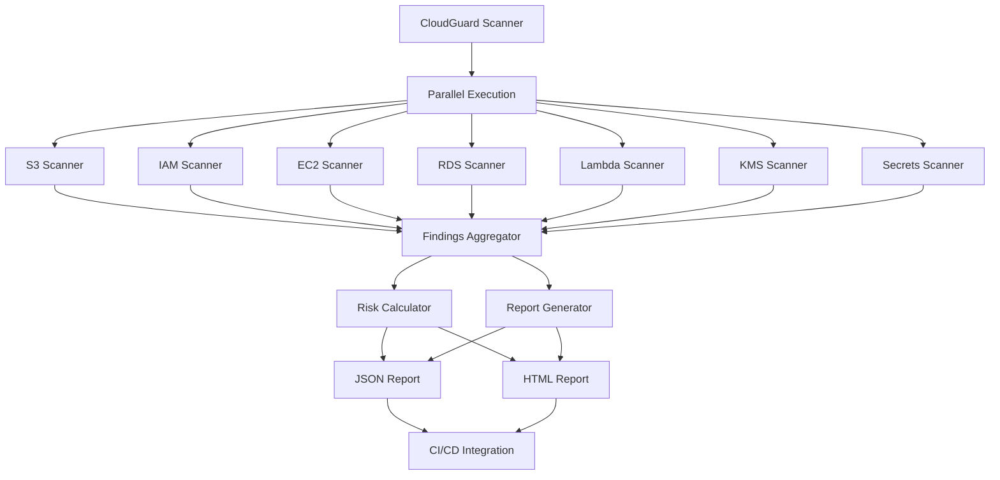

# AWS Security Scanner

[](https://www.python.org/downloads/)
[](https://opensource.org/licenses/MIT)
[](https://aws.amazon.com/)
[](https://github.com/your-org/cloudguard-enhanced)


Current Features
Performance & Scalability
Parallel Scanning: ThreadPoolExecutor-based concurrent scanning for 5-10x speed improvement

Pagination Support: Handles AWS accounts with thousands of resources

Configurable Workers: Adjust thread pool size based on your environment

Real-time Progress: Verbose mode shows live scanning progress

Retry Logic: Exponential backoff for robust API calls

Comprehensive Security Checks
S3 Buckets: Public access, encryption, versioning, MFA delete for sensitive buckets

IAM Policies: Root MFA, password policies, unused access keys (90+ days)

EC2 Security Groups: Public access rules, IPv6 support, overly permissive configurations

RDS Instances: Public accessibility, encryption, Multi-AZ configuration

CloudTrail: Trail existence, log validation, encryption

EBS Volumes: Encryption status, attached vs unattached volumes

KMS Keys: Key rotation status, policy validation, AWS-managed vs customer-managed

VPC Flow Logs: Flow log configuration for network monitoring

Secrets Manager: Rotation status, unused secrets, replication compliance

Lambda Functions: Deprecated runtimes, public URLs, overly permissive policies

Reporting
Risk Scoring: 0-100 scoring with severity-based deductions (A-F grades)

Structured Output: JSON with metadata for automation pipelines

HTML Reports: Human-readable web format with color-coded findings

Statistics: Top risky resources, average risk scores, scan duration

CI/CD Integration: Configurable exit codes for automation

Features
Tag-based Filtering: Skip resources based on environment tags

Detailed Remediation: Step-by-step fix instructions with AWS CLI commands

Compliance Mapping: CIS AWS, PCI-DSS, HIPAA, SOC2 framework alignment

Configurable Severity: Adjust fail-on-critical behavior for CI/CD

Service Filtering: Skip specific services for targeted scans
## Installation

### Prerequisites
- **Python 3.7+** (tested on 3.7, 3.8, 3.9, 3.10, 3.11)
- **AWS Credentials** configured (via AWS CLI, environment variables, or IAM role)
- **Read-only permissions** for the services being scanned

### Quick Start
```bash
# Clone the repository
git clone https://github.com/your-org/cloudguard-enhanced.git
cd cloudguard-enhanced

# Install dependencies
pip install -r requirements.txt

# Run basic scan
python cg.py
```

### Docker Installation
```bash
# Build Docker image
docker build -t cloudguard-enhanced .

# Run scan with AWS credentials
docker run -v ~/.aws:/root/.aws cloudguard-enhanced
```

## 🚀 Usage

### Basic Scanning
```bash
# Basic scan with defaults
python cg.py

# High-performance scan for large accounts
python cg.py --workers 16 --verbose

# CI/CD integration with structured output
python cg.py --fail-on-critical --json security-report.json
```

### Advanced Options
```bash
# Custom AWS profile and region
python cg.py --profile production --region us-west-2

# Skip specific services for faster scans
python cg.py --skip-services lambda secrets --workers 12

# Output to stdout for CI/CD pipelines
python cg.py --json - --html - --fail-on-critical

# Development environment scan
python cg.py --skip-services rds kms --json dev-report.json
```

### Command Line Options
| Option | Description | Default |
|--------|-------------|---------|
| `--profile` | AWS CLI profile name | `default` |
| `--region` | AWS region to scan | `us-east-1` |
| `--json` | JSON output file path (use `-` for stdout) | `cloudguard_report.json` |
| `--html` | HTML output file path (use `-` for stdout) | `cloudguard_report.html` |
| `--workers` | Number of parallel workers | `8` |
| `--verbose` | Enable verbose logging | `False` |
| `--skip-services` | Skip specific services | `None` |
| `--fail-on-critical` | Exit with error code if critical findings found | `False` |


```json
{
  "timestamp": "2024-01-15T10:30:00Z",
  "score": {
    "score": 85,
    "grade": "B",
    "counts": {
      "CRITICAL": 0,
      "HIGH": 2,
      "MEDIUM": 5,
      "LOW": 3
    },
    "total": 10
  },
  "findings": [...],
  "metadata": {
    "scanner_version": "2.0.0",
    "total_findings": 10,
    "severity_breakdown": {...},
    "scan_duration": 45.2
  },
  "statistics": {
    "average_risk_score": 65.5,
    "top_5_risky": [...]
  }
}
```

## CI/CD Integration

### GitHub Actions
```yaml
name: Security Scan
on: [push, pull_request]

jobs:
  security-scan:
    runs-on: ubuntu-latest
    steps:
      - uses: actions/checkout@v3
      - name: Setup Python
        uses: actions/setup-python@v4
        with:
          python-version: '3.11'
      - name: Install dependencies
        run: pip install -r requirements.txt
      - name: Run security scan
        run: |
          python cg.py --fail-on-critical --json security-report.json
        env:
          AWS_ACCESS_KEY_ID: ${{ secrets.AWS_ACCESS_KEY_ID }}
          AWS_SECRET_ACCESS_KEY: ${{ secrets.AWS_SECRET_ACCESS_KEY }}
      - name: Upload security report
        uses: actions/upload-artifact@v3
        with:
          name: security-report
          path: security-report.json
```

### Jenkins Pipeline
```groovy
pipeline {
    agent any
    stages {
        stage('Security Scan') {
            steps {
                sh 'python cg.py --workers 12 --json security-report.json'
                publishHTML([
                    allowMissing: false,
                    alwaysLinkToLastBuild: true,
                    keepAll: true,
                    reportDir: '.',
                    reportFiles: 'cloudguard_report.html',
                    reportName: 'Security Report'
                ])
            }
        }
    }
    post {
        failure {
            emailext (
                subject: "Security Scan Failed - ${env.JOB_NAME}",
                body: "Critical security findings detected in ${env.BUILD_URL}",
                to: "security-team@company.com"
            )
        }
    }
}
```

### GitLab CI
```yaml
security_scan:
  stage: security
  image: python:3.11
  before_script:
    - pip install -r requirements.txt
  script:
    - python cg.py --fail-on-critical --json security-report.json
  artifacts:
    reports:
      junit: security-report.json
    paths:
      - security-report.json
      - cloudguard_report.html
  only:
    - main
    - develop
```

## Required AWS Permissions

Create an IAM policy with the following permissions:

```json
{
    "Version": "2012-10-17",
    "Statement": [
        {
            "Effect": "Allow",
            "Action": [
                "s3:ListAllMyBuckets",
                "s3:GetBucketAcl",
                "s3:GetBucketEncryption",
                "s3:GetBucketVersioning",
                "s3:GetPublicAccessBlock",
                "s3:GetBucketTagging",
                "iam:ListUsers",
                "iam:GetAccountSummary",
                "iam:GetAccountPasswordPolicy",
                "iam:ListAccessKeys",
                "iam:GetAccessKeyLastUsed",
                "ec2:DescribeSecurityGroups",
                "ec2:DescribeVolumes",
                "ec2:DescribeVpcs",
                "ec2:DescribeFlowLogs",
                "rds:DescribeDBInstances",
                "cloudtrail:DescribeTrails",
                "cloudtrail:GetTrailStatus",
                "lambda:ListFunctions",
                "lambda:GetFunctionUrlConfig",
                "lambda:GetPolicy",
                "kms:ListKeys",
                "kms:DescribeKey",
                "kms:GetKeyRotationStatus",
                "kms:GetKeyPolicy",
                "secretsmanager:ListSecrets",
                "secretsmanager:DescribeSecret"
            ],
            "Resource": "*"
        }
    ]
}
```

## Architecture



## Testing

### Unit Tests
```bash
# Run unit tests
python -m pytest tests/

# Run with coverage
python -m pytest --cov=cg tests/
```

### Integration Tests
```bash
# Test against AWS account (requires credentials)
python -m pytest tests/integration/ --aws-profile test-profile
```

### Performance Tests
```bash
# Benchmark large account scanning
python tests/benchmark.py --account-size large --workers 16
```

